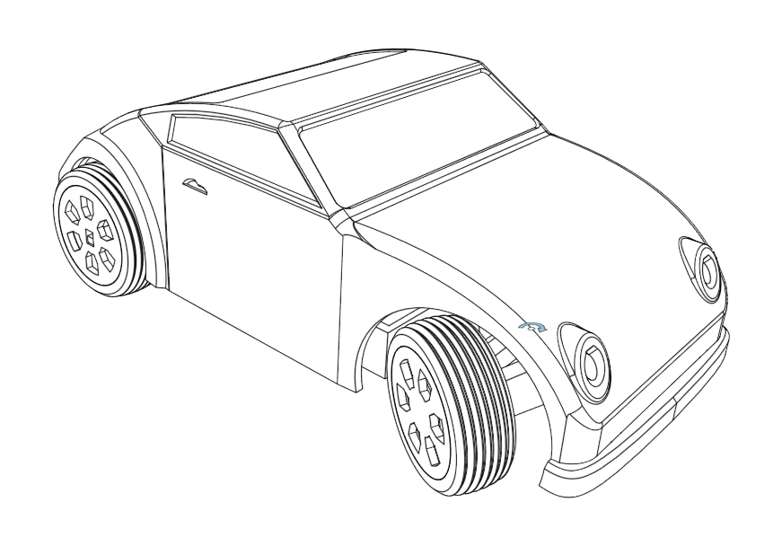
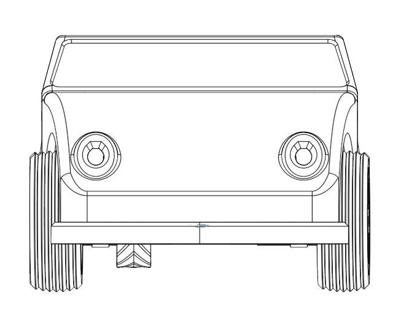
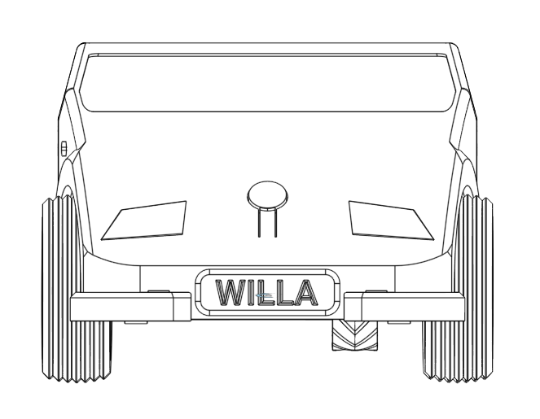
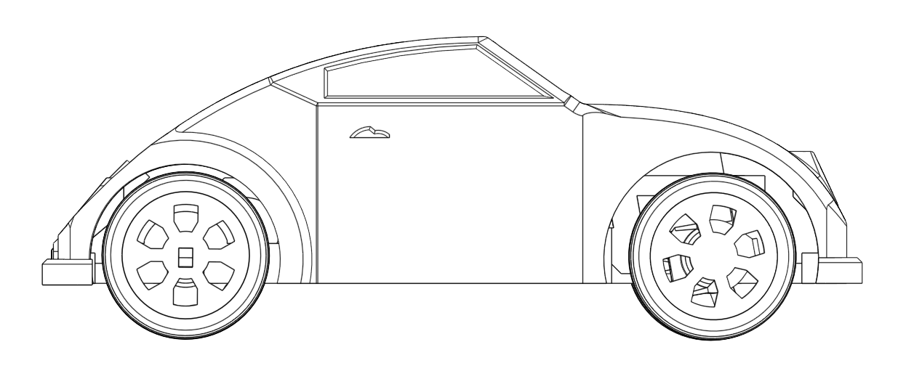
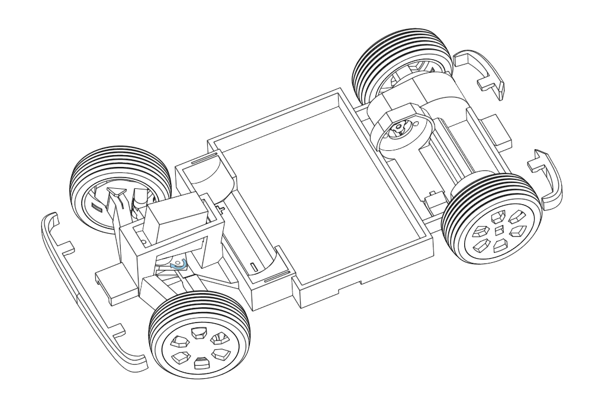
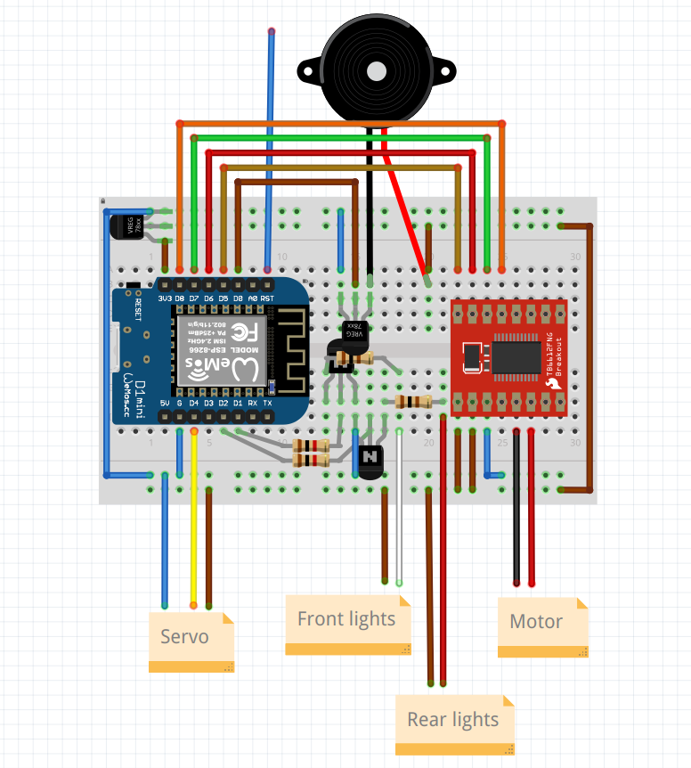

Willa is a 3d printed car that runs on cheap electronics and is controlled through a cell phone. 

You can find the 3d models [here](https://cad.onshape.com/documents/a3768c69ddd425673407c209/w/250f642c82b616bd2bcb1eaa/e/00e849b00b7325b7d3f46ea1?renderMode=3&leftPanel=false&uiState=654e36dd3d2ae33b74140e15) which should be good for printing on a regular fdm 3d printer with no supports. 

The car's [microcontroller program](willa-mcu) is rather simple and based on arduino for esp8266. The [controller](willa-app) is a web application meant for a cell phone. The UI definitely needs some work.

The electronic components needed are quite cheap and easy to find. 

This is a public personal project and it's not well documented. Feel free to file an issue if you need help making one yourself!

## Some pictures of the 3d model

## Breadboard and components

This is not in sync with the current code (pin selection).

## Printable stl files

Parts can be exported from onshape or you can find them already lined up for printing [here](stl/)

